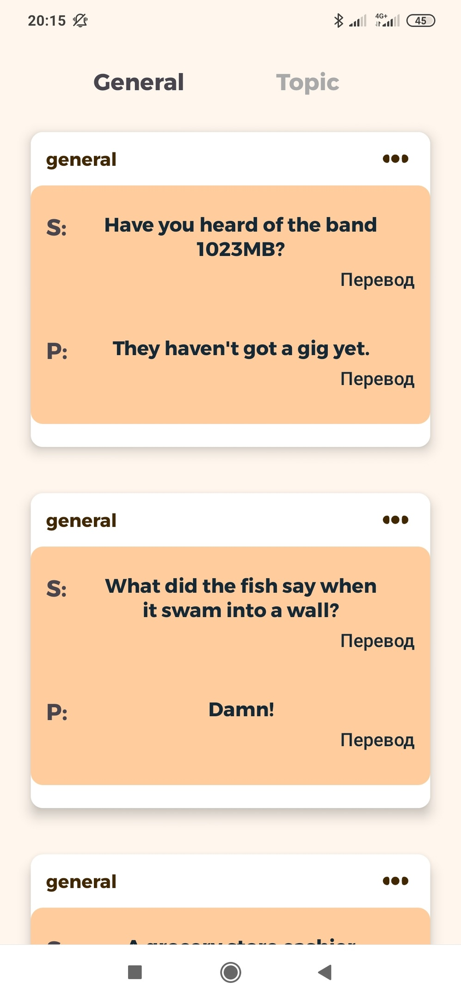
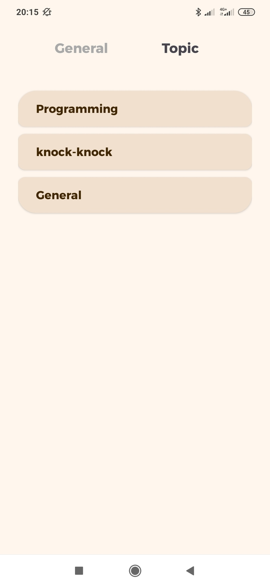

# Anektochka-Retrofit [Retrofit,Viewmodels&Fragment,Hilt,OkHttp]

Application for studying the retrofit library, as well as logging with Okhttp

## Screenshots
Screenshot of each fragment

</img>
</img>

## Structure

#### Model
The model contains an interface for retrofit.

#### View
View are classic fragment.
 
#### ViewModel
ViewModels contain the logic of their screens.

## OkHttp
OkHttp is used to log the result.

## Retrofit
Retrofit is used to get a list of jokes.
